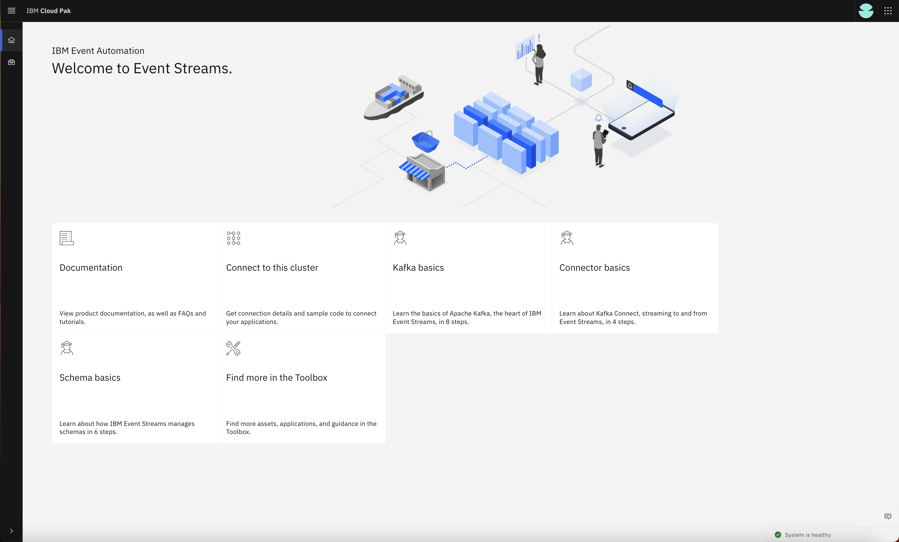

# Advanced Lab

## Prerequsites

1. You need to complete [Basic Lab](BasicLab.md).

1. Install Tools 
    1. [Apache Kafka](https://kafka.apache.org/quickstart) - contains a script used to publish message to a topic.

## Required additional capabilities/components

The Advanced Lab is based on Cloud Pak for Integration 2023.2.1. The versions of each <u>additional</u> components used are:

1. Operators (installed in Basic Lab)
    1. IBM Event Streams v3.2
    1. Crunchy Postgres for Kubernetes v5.4.1

1. Instances
    1. Event Streams platform (latest version)
    2. PostgreSQL database v15

## Deploy IBM Event Streams

1. Go to the folder `demo-pre-reqs`, if you have not done.
1. Create `eventstreams` project.
    ```sh
    oc new-project eventstreams
    ```
    Results:
    ```sh
    Now using project "eventstreams" on server "https://api.<clusterID>.<domainName>:6443".
1. Setup ibm entitlement key.
    ```sh
    oc create secret docker-registry ibm-entitlement-key --docker-username=cp --docker-password=${IBM_ENTITLEMENT_KEY} --docker-server=cp.icr.io -n eventstreams
    ```
    Results:
    ```sh
    secret/ibm-entitlement-key created
    ```
1. Setup environment variables.
    ```sh
    export ES_LICENSE=L-YBXJ-ADJNSM
    envsubst < kafka/eventstreams.yaml.tmpl > kafka/eventstreams.yaml
    ```
1. Install Event Streams.
    ```sh
    oc apply -f ./kafka
    ```
    Results:
    ```sh
    kafkauser.eventstreams.ibm.com/appconnect-kafka-user created
    eventstreams.eventstreams.ibm.com/event-backbone created
    secret/kafka-connection-info created
    kafkatopic.eventstreams.ibm.com/todo.updates created
    ```
1. Check installation status for EventStreams.
    ```sh
    oc get eventstreams event-backbone -n eventstreams
    ```
    Results:
    ```sh
    NAME             STATUS
    event-backbone   Ready
    ```
1. Access Event Stream UI to verify installation.
    1. Get URL.
        ```sh
        oc get route -n eventstreams event-backbone-ibm-es-ui -ojson | jq -r .spec.host
        ```
        Results:
        ```sh
        event-backbone-ibm-es-ui-eventstreams.apps.<clusterID>.<domainName>
        ```
    1. Get credentials.
        ```sh
        oc get secret -n ibm-common-services platform-auth-idp-credentials -ojson | jq -r .data.admin_password | base64 -d
        ```
    1. Go to private window of a browser (incognito mode) and login to Event Stream UI.
        

## Deploy PostgreSQL database

1. Create `postgresql` project and setup ibm entitlement key
    ```sh
    oc new-project postgresql
    ```
    Results:
    ```sh
    Now using project "postgresql" on server "https://api.64e01bd0fa254600179b97b4.cloud.techzone.ibm.com:6443".
    ```
1. Set RWO block storageclass as default storageclass.
    ```sh
    oc patch storageclass ${BLOCK_STORAGECLASS} -p '{"metadata": {"annotations":{"storageclass.kubernetes.io/is-default-class":"true"}}}'
    ```
1. Install PostgreSQL.
    1. Create configmap.
       ```sh
       oc apply -f ./postgresql/db-data.yaml
       ```
       Results:
       ```sh
       configmap/pg-initial-data-cm created
       ```
    1. Create PostgreSQL
       ```
       oc apply -f ./postgresql/database.yaml
       ```
       Results:
       ```
       postgrescluster.postgres-operator.crunchydata.com/store created
       ```
1. Check installation status for PostgresSQL, make sure all the pods are Running (or Completed).
    ```sh
    oc get po -n postgresql
    ```
    Results:
    ```sh
    NAME                               READY   STATUS      RESTARTS   AGE
    store-00-pknl-0                    4/4     Running     0          6m28s
    store-backup-t9bc-d2w25            0/1     Completed   0          5m40s
    store-pgbouncer-7487d969cf-6mqgd   2/2     Running     0          6m27s
    store-repo-host-0                  2/2     Running     0          6m28s
    ```
1. Access the database to verify installation.
    ```sh
    oc exec -it -n postgresql -c database \
      $(oc get pods -n postgresql --selector='postgres-operator.crunchydata.com/cluster=store,postgres-operator.crunchydata.com/role=master' -o name) \
      -- psql -d store
    ```
    Results:
    ```
    psql (15.3)
    Type "help" for help.
    ```
    Issue SQL command `select * from todos;`
    ```sql
    store=# select * from todos;
    id | user_id | title | encoded_title | is_completed 
    ----+---------+-------+---------------+--------------
    (0 rows)
    ```

## Setup Tekton Pipeline

<i>(If you have completed [Basic Lab](./BasicLab.md)), the Pipeline is already setup.)</i>

## Deploy "sample-ace-application" integration server using Tekton

1. Go to the folder `app-connect-tekton-pipeline`.
1. Setup environment variables.
    ```sh
    export FILE_STORAGECLASS=ocs-storagecluster-cephfs
    export ACE_LICENSE=L-LFMR-BTD75V
    export ACE_VERSION=12.0.9.0-r1
    export ACE_IMAGE_URL=cp.icr.io/cp/appc/ace-server-prod@sha256:246828d9f89c4ed3a6719cd3e4b71b1dec382f848c9bf9c28156f78fa05bc4e7
    envsubst < complex-pipelinerun.yaml.tmpl > complex-pipelinerun.yaml
    ```
    Refer to the documentation on the values needed [Licensing reference for App Connect](https://www.ibm.com/docs/en/app-connect/containers_cd?topic=resources-licensing-reference-app-connect-operator) and [App Connect server image](https://www.ibm.com/docs/en/app-connect/containers_cd?topic=obtaining-app-connect-enterprise-server-image-from-cloud-container-registry).
1. Run the pipeline.
    ```sh
    ./1-deploy-complex-integration-server.sh
    ```
    Results:
    ```
    > ---------------------------------------------------------------
    > running the pipeline
    > ---------------------------------------------------------------
    pipelinerun.tekton.dev/ace-deploy-lcd98
    > ---------------------------------------------------------------
    > tailing pipeline logs
    > ---------------------------------------------------------------
    ....
    ....
    ....
    > ---------------------------------------------------------------
    > pipeline complete
    > ---------------------------------------------------------------
    ```
1. View Pipelinerun in OpenShift Console.
    

## Test `sample-ace-application` integration server

1. Produce a message to the Kafka topic that will trigger the complex ACE flow.
    ```sh
    BOOTSTRAP=$(oc get eventstreams event-backbone -neventstreams -ojsonpath='{.status.kafkaListeners[1].bootstrapServers}')
    PASSWORD=$(oc get secret -neventstreams appconnect-kafka-user -ojsonpath='{.data.password}' | base64 -d)
    oc get secret -neventstreams event-backbone-cluster-ca-cert -ojsonpath='{.data.ca\.p12}' | base64 -d > ca.p12
    CA_PASSWORD=$(oc get secret -neventstreams event-backbone-cluster-ca-cert -ojsonpath='{.data.ca\.password}' | base64 -d)

    echo '{"id": 1, "message": "quick test"}' | ./kafka-console-producer.sh \
        --bootstrap-server $BOOTSTRAP \
        --topic TODO.UPDATES \
        --producer-property "security.protocol=SASL_SSL" \
        --producer-property "sasl.mechanism=SCRAM-SHA-512" \
        --producer-property "sasl.jaas.config=org.apache.kafka.common.security.scram.ScramLoginModule required username="appconnect-kafka-user" password="$PASSWORD";" \
        --producer-property "ssl.truststore.location=ca.p12" \
        --producer-property "ssl.truststore.type=PKCS12" \
        --producer-property "ssl.truststore.password=$CA_PASSWORD"
    ```

2. Check that the ACE flow put something in PostgreSQL.
    ```sh
    oc exec -it -n postgresql -c database \
      $(oc get pods -n postgresql --selector='postgres-operator.crunchydata.com/cluster=store,postgres-operator.crunchydata.com/role=master' -o name) \
      -- psql -d store
    ```
    Issue SQL command `select * from todos;`
    ```sql
    store=# select * from todos;
    id | user_id |       title        |            encoded_title             | is_completed
    ----+---------+--------------------+--------------------------------------+--------------
      1 |       1 | delectus aut autem | RU5DT0RFRDogZGVsZWN0dXMgYXV0IGF1dGVt | f
    (1 row)
    ```